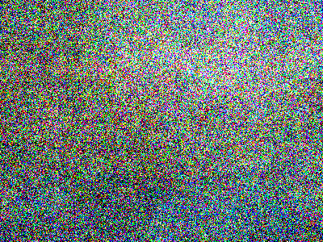
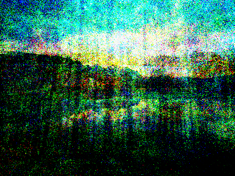
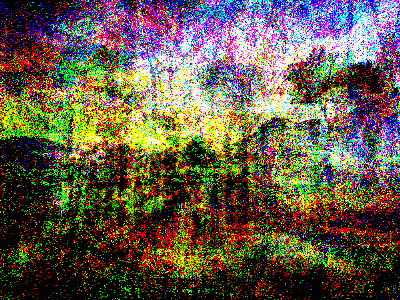
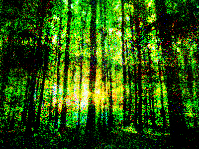
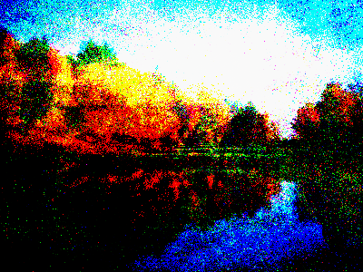

# Skyi Dreams
SkyiDreams uses an autoencoder network to learn the style of images and
dream up new ones. Just put some pictures in the memories folder - Skyi
will dream up some awesome pictures and put them in the dreams folder.

## Samples

